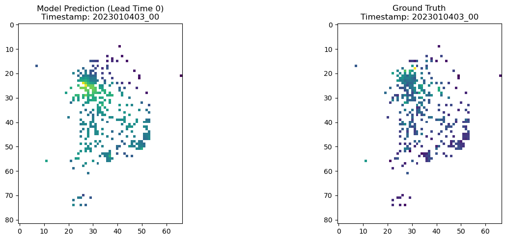

# 강화 학습 및 인공 지능 최종 프로젝트

### Conda 환경 설치하기

Conda는 파이썬과 패키지 관리를 도와주는 도구입니다. 초보자를 위한 간단한 설명으로, Conda는 파이썬 프로젝트에서 필요한 **패키지(라이브러리)** 또는 환경을 쉽게 관리하게 해줍니다. 여기서 환경이란, 특정 프로젝트에 필요한 파이썬 버전과 패키지들을 따로 모아서 사용하는 공간을 뜻합니다.

#### Conda의 주요 기능
- 패키지 설치 및 업데이트: Conda는 프로젝트에서 사용하는 패키지들을 쉽게 설치하고, 업데이트할 수 있게 해줍니다.
- 환경 관리: 프로젝트마다 필요한 파이썬 버전과 패키지가 다를 수 있는데, Conda를 사용하면 각각의 프로젝트에 맞는 환경을 따로 설정해서 충돌 없이 작업할 수 있습니다.

예를 들어, 만약 프로젝트 A에서 파이썬 3.8을 사용하고, 프로젝트 B에서 파이썬 3.9를 사용한다면, Conda를 통해 두 가지 환경을 각각 설정할 수 있습니다. 이렇게 하면 한 프로젝트에서 사용하는 패키지나 파이썬 버전이 다른 프로젝트에 영향을 주지 않게 됩니다.

#### 컴퓨터에 Conda 설치하기 
Conda를 컴퓨터에 설치하려면, 주로 Anaconda나 Miniconda 중 하나를 사용합니다. 두 가지 모두 Conda를 포함하고 있지만, Anaconda는 더 많은 패키지들이 기본적으로 설치되어 있어서 Anaconda를 권장합니다.

- 1단계: **Anaconda 다운로드**

    Anaconda 다운로드 페이지로 이동하여, 운영 체제에 맞는 설치 파일을 다운로드합니다.

- 2단계: 설치

    다운로드한 파일을 실행하고, 설치 과정에 따라 기본 옵션을 선택하여 설치를 진행합니다.

- 3단계: 설치 확인

    설치가 완료되면, Conda 명령어로 설치를 확인합니다:

    ```bash
    conda --version
    ```

#### 첫 환경 만들어보기
Conda 환경을 하나 생성해봅시다. `test`라는 이름의 가상 환경을 만들고, python version `3.10`을 설치해봅시다. 아래 명령어를 실행하면 됩니다.

```bash
conda create -n test python=3.10
```

생성한 가상 환경 안에서 작업하고 싶다면, 아래 명령어를 입력합니다.

```bash
conda activate test
```

### (선택) PyTorch 설치하기
PyTorch는 다음 사이트에서 사용하는 컴퓨터의 사양에 맞게 설치합니다.

https://pytorch.org/

### (점검해보기) Conda 환경에서 간단한 인공지능 학습해보기

Conda 환경을 생성한 이후, 필요한 패키지(라이브러리)는 실행한 Conda 환경에 직접 설치하여 사용하면 됩니다. Conda 환경을 제대로 사용하기 위해 `simple_example.ipynb` 파일의 코드를 실행해봅시다. 

- `test` 환경에 필요한 패키지를 직접 설치해봅시다. 주어진 코드에서 필요한 라이브러리가 무엇인지 직접 파악해봅시다.
- 주어진 `.ipynb` 파일 안에 있는 코드를 `.py` 파일에 옮겨서 실행해봅시다. 

----

### 강화 학습을 이용해 에이전트 학습하기

수업 때 배운 강화 학습 알고리즘을 직접 사용해봅시다. `gynmasium`에서 제공하는 다양한 환경에서 강화 학습 에이전트를 학습합니다.

#### Conda 환경 관리하기

강화 학습 알고리즘이 이미 구현된 라이브러리를 사용해 주어진 환경에서 강화 학습 에이전트를 학습해봅시다. 강화 학습 라이브러리와 환경 라이브러리를 설치하려면, 아래 패키지들을 설치해봅시다.

먼저, 위에서 연습한대로 conda 가상 환경을 만들어봅시다. `gymnasium`과 같은 라이브러리가 잘 작동하려면, 꼭 3.10 버전의 python을 사용합니다:

```bash
conda create -n my_env_name python=3.10
conda activate my_env_name
```

모든 패키지를 설치하기 전에, 사용하는 컴퓨터 환경에 맞는 PyTorch를 설치합니다:

https://pytorch.org/

그 다음, 아래 패키지들을 설치합니다.

```bash
pip install "stable-baselines3[extra]>=2.0.0a4"
pip install "gymnasium[box2d]"
...
```

#### 강화 학습 알고리즘에 대한 간단한 이해

강화 학습에서 주로 사용하는 알고리즘들은 아래와 같습니다.
- **PPO**: Proximal Policy Gradient
- **DQN**: Deep Q-Network
- ...

각 알고리즘에 대한 설명은 이전 강의자료를 참고해주세요.

#### 인공지능 모델 구조에 대한 간단한 이해

강화 학습에서 사용되는 정책은 아래와 같이 표현할 수 있습니다.

$$\pi(a | s)$$

즉, 주어진 상태 $s$에 대해 취할 행동 $a$를 선택하는 정책을 학습하는 것이 강화 학습의 주요 목표였습니다. 상태 $s$의 형태에 따라 정책을 구현하기 위해 필요한 인공지능 모델이 달라집니다:
- 만약 상태 $s$가 벡터의 형태로 주어진다면, MLP와 같은 간단한 구조로도 충분히 정책을 학습할 수 있습니다.
- 만약 상태 $s$가 가변적 길이의 수열(sequence)이라면, RNN 계열의 신경망 구조를 고려해볼 수 있습니다.
- 또는 주어진 상태 $s$가 이미지 형태라면, CNN 계열의 구조를 사용하면 효과적입니다.

각 모델에 대한 자세한 설명은, 이전 강의자료를 참고해주세요.

#### 몇 가지 예제 직접 학습해보기

직접 강화 학습 에이전트를 학습해봅시다. 먼저 풀고싶은 환경을 정합니다. `gymnasium`에서 제공하는 환경은 아래 사이트에서 확인할 수 있습니다.

다음으로는 적절한 학습 알고리즘과 모델을 골라야합니다. 선택한 알고리즘과 모델을 이용해 강화 학습 에이전트를 직접 학습하려면, `reinforcement_learning.py`의 코드를 직접 실행해보세요.

연구 질문: 
`Breakout`과 같은 환경에서 아래와 같은 모습을 발견할 수 있나요?

https://www.youtube.com/watch?time_continue=17&v=TmPfTpjtdgg&embeds_referring_euri=https%3A%2F%2Fdocs.google.com%2F&embeds_referring_origin=https%3A%2F%2Fdocs.google.com&source_ve_path=Mjg2NjY

더 자세한 코드 설명은 아래 링크들을 참고해주세요.
- https://colab.research.google.com/github/Stable-Baselines-Team/rl-colab-notebooks/blob/sb3/atari_games.ipynb#scrollTo=gWskDE2c9WoN
- https://stable-baselines3.readthedocs.io/en/master/guide/examples.html

----

### 인간 피드백을 통한 강화 학습 보상 함수 설계

#### 보상 함수 설계

강화 학습 문제를 정의할 때 가장 어려운 작업 중 하나는 보상 함수를 설계하는 것입니다. 보상 함수를 잘 정의한 것 같아도, 실제 강화 학습 알고리즘을 통해 에이전트를 학습하면 예상치 못한 행동을 관찰하게 될 수 있습니다.

#### 인간 피드백을 통한 강화 학습

보상 함수를 설계하기 어려운 상황에서, 사람의 직관을 이용해 보상 함수를 비슷하게 학습할 수 있습니다.

#### 보상 모델 학습 체험하기

`train_reward_model.py`에 보상 함수 학습 코드를 작성한 후 실행해봅시다. 보상 함수를 학습하기 위해서는 인간 피드백 데이터가 필요합니다. 데이터를 직접 라벨링 한 후, 이 데이터를 이용한 보상 함수를 학습해봅시다.

----

### 언어모델 추가 학습하기

#### 언어 모델에 대한 기초적인 이해

컴퓨터가 인식하는 기본 단위는 “숫자" 혹은 “숫자로 이루어진 행렬"인데, 사람의 언어를 어떻게 숫자 혹은 숫자로 이루어진 행렬로 표현하기 위해서는 언어를 구성하는 최소 단위로 쪼개서, 각 단위에 고유한 숫자를 부여해줍니다. 이를 토큰화(tokenization)라고 부릅니다. 그 후, RNN과 같은 모델을 사용해 가변적인 길이의 입력값을 처리하여 학습합니다.

#### 언어 모델 학습 방법에 대한 기초적인 이해

언어모델을 학습하는 가장 단순한 방법은 최대한 많은 문장을 모델에게 알려주는 것입니다. 언어모델은 순차적으로 다음 토큰(단어)을 생성합니다. 지도 학습을 효과적으로 적용하려면, 주어진 문장의 다음 토큰(단어)를 정답으로 모델에게 제공합니다. 이러한 방법을 통해, 모델은 문장을 한 토큰(단어)씩 생성하는 법을 배우게 됩니다.

#### 언어 모델 학습 데이터 찾아보기

언어 모델에 사용할 수 있을만한 데이터를 `huggingface`에서 찾아봅시다.

#### 농담 생성하는 모델 학습해보기

아래 두 링크를 참고하여 `train_language_model.py`에 학습 코드를 작성한 후 실행해봅시다.
- (데이터셋) https://github.com/amoudgl/short-jokes-dataset/blob/master/data/funjokes.csv 
- (학습 코드) https://discuss.huggingface.co/t/fine-tuning-gpt2-for-question-answering/31895

----

### 이미지 수정하기

#### 이미지 생성 모델에 대한 기초적인 이해

현재까지 배운 인공지능의 기본 개념은 데이터를 이용해 어떤 함수를 학습한 것이지만, 생성 모델에서는 “샘플링”이 중요하며, 이는 랜덤 값을 데이터로 바꿔주는 함수라고 이해할 수 있습니다. 즉, 생성 모델은 랜덤한 노이즈를 입력받아 데이터의 형태로 바꿔주는 함수로 볼 수 있습니다.

이미지 처리 모델은 대부분 CNN 기반으로 이루어져 있습니다.

#### Diffusion 모델을 이용한 이미지 생성

Diffusion 기반의 모델은 이미지를 노이즈로 파괴한 후, 파괴된 이미지를 
복원하는 법을 학습합니다. `huggingface`에서 이미지 생성 모델과 Diffusion 모델을 찾아봅시다.

<!-- #### 이미지 수정 방법 개요

#### 생성한 이미지 수정해보기 -->

#### 내 사진 수정해보기

내 사진을 업로드 한 후, 내 사진을 직접 원하는 방향으로 수정해봅시다. 이미지 수정 모델을 `huggingface`에서 찾아 `vision_edit_image.py` 아래에 구현해봅시다.

----

### 기상 예측 모델 만들어보기

#### 기상 데이터와 이미지 데이터

기상 데이터는 주로 이미지의 형태로 변형하여 사용합니다.

  

#### 미세 먼지 농도 예측하기

주어진 미세먼지 데이터를 활용해 간단한 기상 예측 모델을 만들어봅시다.